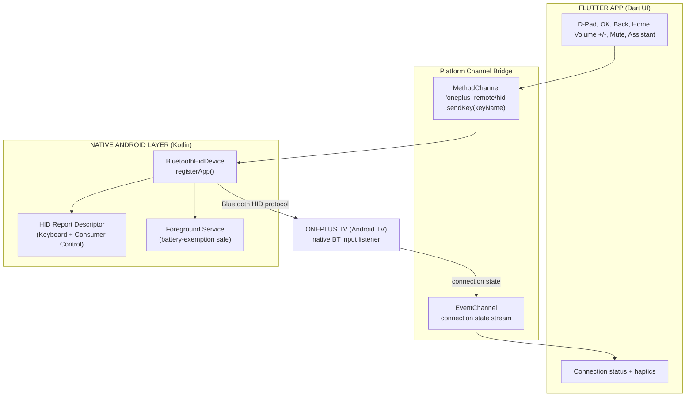
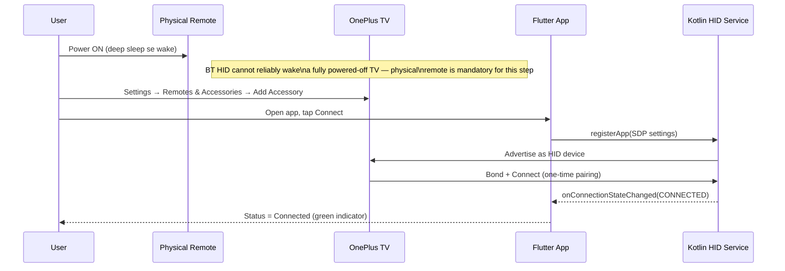
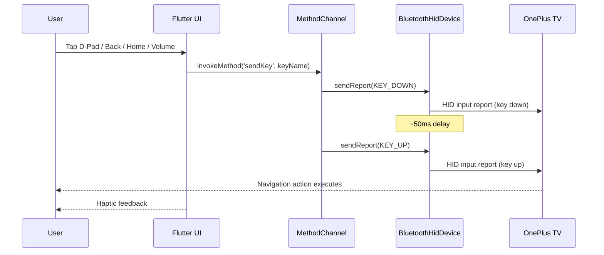

# OnePlus TV Bluetooth Remote — Flutter App (Updated Plan)

Phone ko Android's **Bluetooth HID Device profile** se ek genuine wireless remote/keyboard banaya jayega, jise OnePlus TV (Android TV) bina kisi extra TV-side app ke pehchan legi.

**Research se confirm hua:** `BluetoothHidDevice.registerApp()` sirf `BLUETOOTH_CONNECT` runtime permission maangta hai (`BLUETOOTH_PRIVILEGED` nahi) — matlab third-party app se yeh legally aur technically possible hai, API 28 (Android 9) se. Koi ready Flutter plugin is kaam ke liye maujood nahi, isliye native Kotlin + MethodChannel bridge hi sahi rasta hai.

---

## 1. System Architecture

---

## 2. Pairing & Wake Flow

---

## 3. Key Press Flow

---

## 4. Development Phases

```mermaid
gantt
    dateFormat  X
    axisFormat %d
    title MVP Timeline (in days)
    section Phase 1
    Native HID setup (Kotlin)        :p1, 0, 2d
    section Phase 2
    Platform Channel + key codes     :p2, after p1, 1d
    section Phase 3
    Flutter Remote UI + haptics      :p3, after p2, 1d
    section Phase 4
    Pairing & TV testing             :p4, after p3, 1d
```

| Phase | Kaam | Time |
|---|---|---|
| 1 | Bluetooth permissions, `BluetoothHidDevice` registration, HID Report Descriptor (D-pad, Back, Home, Volume, Media keys) | 1–2 din |
| 2 | `MethodChannel` (sendKey), `EventChannel` (connection state) | 1 din |
| 3 | OnePlus-style dark UI: D-pad, Back, Home, Volume, Mute, haptics | 1 din |
| 4 | Real TV pairing + bug fixing | 1 din |
| **Total** | **Working MVP** | **~3–5 din** |

---

## 5. Updated Risk Notes (naye findings)

| Risk | Detail | Mitigation |
|---|---|---|
| **OEM battery kill** | OxygenOS background service ko aggressively kill karta hai | HID service ko foreground service banao + battery-optimization exemption request karo (Phase 1 me hi) |
| **Assistant / mic button** | Physical remote ke center mic button (image me dikh raha) ke liye simple keyboard keycode kaam nahi karega — special HID usage code chahiye jo har TV firmware support nahi karta | Phase 4 me separately test karo; fallback: is button ko skip karo ya baad me add karo |
| **No Flutter plugin exists** | pub.dev pe koi ready package nahi mila jo Android ko HID *peripheral* banaye | Native Kotlin + MethodChannel bridge confirmed as the only route |
| **Deep-sleep wake** | BT HID se poori tarah OFF TV wake nahi hoti | Physical remote se power-on — plan me already correct |

---

## 6. Key Mapping Reference

| Remote Button | HID Usage |
|---|---|
| D-Pad Up/Down/Left/Right | Keyboard Arrow Keys |
| OK / Center | Keyboard Enter |
| Back | Keyboard Escape / AC_BACK (Consumer) |
| Home | AC_HOME (Consumer Control) |
| Volume +/- | VOLUME_INCREMENT / VOLUME_DECREMENT |
| Mute | Consumer Mute |
| Assistant (mic) | ⚠️ Needs extra research per-TV — not standard keyboard usage |
| Netflix / Prime / YouTube app buttons | Not achievable via plain HID keys — would need TV-specific deep links (out of scope for HID-only approach) |

---

**Next step:** Phase 1 se start karein — Kotlin `BluetoothHidDevice` registration + Report Descriptor code likhna shuru karein?
